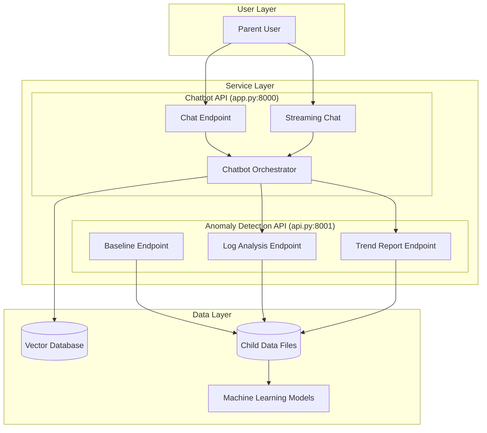
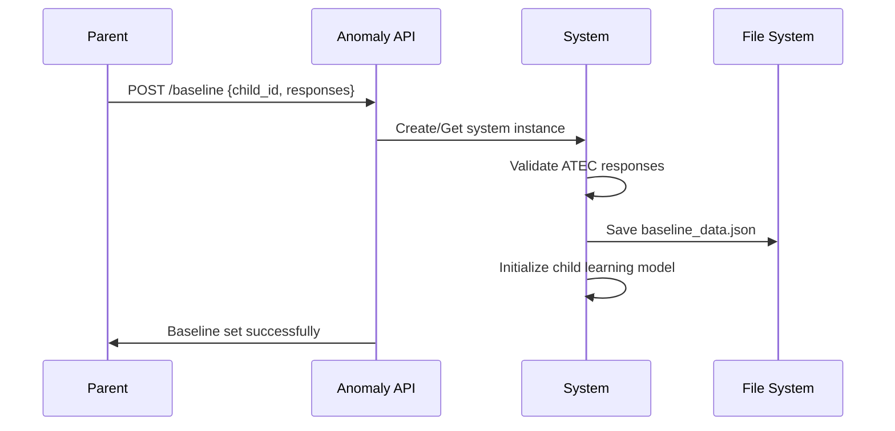
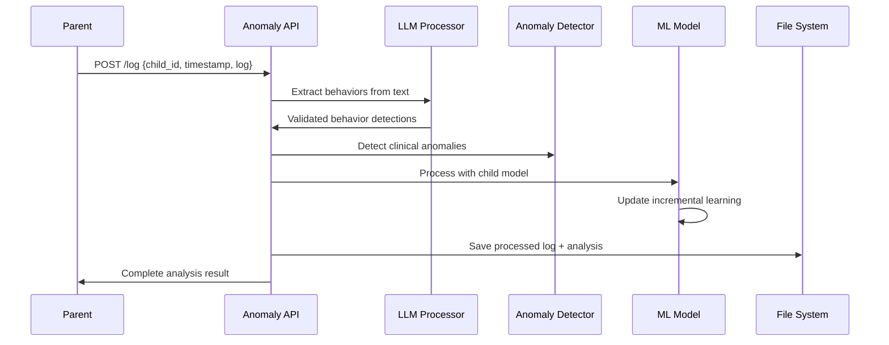
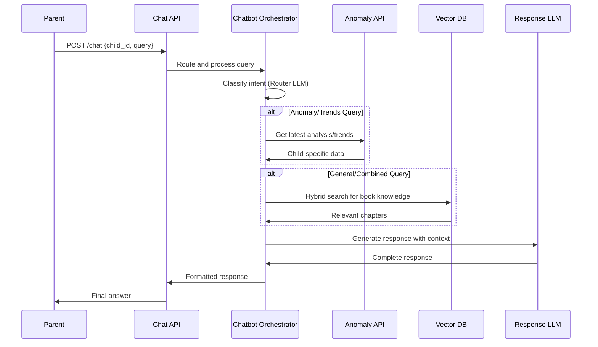

# Seva - ASD Behavioral Monitoring System
## Comprehensive Architecture Documentation

---

## Table of Contents
1. [System Overview](#system-overview)
2. [Core Architecture](#core-architecture)
3. [Service Layer](#service-layer)
4. [Data Processing Pipeline](#data-processing-pipeline)
5. [Anomaly Detection Engine](#anomaly-detection-engine)
6. [Chatbot Architecture](#chatbot-architecture)
7. [Knowledge Management](#knowledge-management)
8. [Data Flow](#data-flow)
9. [Configuration Management](#configuration-management)
10. [File Structure](#file-structure)
11. [Dependencies](#dependencies)
12. [Deployment Considerations](#deployment-considerations)

---

## System Overview

Seva is a sophisticated ASD (Autism Spectrum Disorder) behavioral monitoring system designed to provide comprehensive analysis and support for parents of children with autism. The system consists of two primary FastAPI services that work in tandem to deliver personalized behavioral analysis and intelligent conversational support.

### Key Features
- **Multi-child Support**: Isolated data processing and chatbot sessions for each child
- **Longitudinal Analysis**: Tracks behavioral patterns over time with incremental learning
- **Clinical Anomaly Detection**: Identifies significant deviations from established baselines
- **Expert Knowledge Integration**: Incorporates "Turn Autism Around" book knowledge via vector search
- **Streaming Responses**: Real-time chatbot interactions with progressive response generation
- **Stateful Architecture**: Persistent system state across API restarts

---

## Core Architecture

### Dual-Service Architecture

The system operates on a **microservices pattern** with two distinct FastAPI applications:



### Service Communication

- **Port Allocation**: Chatbot API (8000), Anomaly Detection API (8001)
- **Inter-service Communication**: HTTP REST calls between services
- **Data Persistence**: File-based storage with automatic state restoration
- **Session Management**: In-memory session stores for both services

---

## Service Layer

### 1. Anomaly Detection Engine (`api.py`)

**Purpose**: Data processing backend for behavioral analysis

**Core Endpoints**:
- `POST /baseline`: Establishes child's baseline ATEC responses
- `POST /log`: Analyzes individual parent journal entries  
- `GET /report/trends/{child_id}`: Generates longitudinal trend reports

**Key Features**:
- **Stateful Operations**: Maintains `IncrementalBehavioralMonitoringSystem` instances per child
- **Automatic Recovery**: Restores system state on startup from saved data
- **Multi-tenant**: Isolated processing pipelines for each child

```python
# Core system initialization pattern
child_systems: Dict[str, IncrementalBehavioralMonitoringSystem] = {}

def get_or_create_system(child_id: str) -> IncrementalBehavioralMonitoringSystem:
    if child_id not in child_systems:
        child_systems[child_id] = IncrementalBehavioralMonitoringSystem(child_id)
    return child_systems[child_id]
```

### 2. Chatbot API (`app.py`)

**Purpose**: User-facing conversational interface

**Core Endpoints**:
- `POST /chat`: Standard synchronous chat responses
- `POST /chat/stream`: Real-time streaming responses
- `GET /`: Health check endpoint

**Key Features**:
- **Session Isolation**: Separate chatbot instances per child
- **Streaming Support**: Server-sent events for progressive response generation
- **Knowledge Integration**: Hybrid search across vector database and anomaly data

```python
# Session management pattern
chat_sessions: Dict[str, Chatbot] = {}

# Streaming response implementation
async def generate_streaming_response(self, query: str):
    # Context gathering + LLM streaming
    for chunk in stream:
        content = chunk.choices[0].delta.content
        if content is not None:
            yield content
```

---

## Data Processing Pipeline

### Behavioral Data Extraction (`enhanced_behavior_extraction.py`)

The system employs a **two-stage filtering approach** for robust behavior detection:

1. **LLM Processing**: Uses Mistral-Small-3.2-24B for nuanced behavior detection
2. **Keyword Validation**: Sanity check filter to prevent hallucinations

```python
def extract_question_level_behaviors(text):
    # Stage 1: LLM detection
    llm_detections = LLM_PROCESSOR_SINGLETON.process_log(text)
    
    # Stage 2: Keyword validation
    validated_detections = []
    for detection in llm_detections:
        if any(keyword in evidence for keyword in keywords):
            validated_detections.append(detection)
        else:
            # Discard potential hallucination
            continue
```

### Feature Engineering

Converts validated behaviors into normalized feature vectors:
- **77-dimensional vectors** corresponding to ATEC questions
- **Normalized scoring** (0-1 scale) based on question max scores
- **Severity mapping**: no_problem(0), mild(1), moderate(2), severe(3)

---

## Anomaly Detection Engine

### Multi-layered Detection System

The system implements **three complementary anomaly detection approaches**:

#### 1. Clinical Anomaly Detection (`enhanced_clinical_anomaly_detector.py`)

```python
class EnhancedClinicalAnomalyDetector:
    def detect_anomalies(self, processed_logs):
        # Individual question-level analysis
        for j, question_id in enumerate(self.question_order):
            if feature_vector[j] > 0:  # Only check detected behaviors
                deviation = feature_vector[j] - self.normalized_baseline[j]
                significance = assess_question_level_significance(deviation, question_id)
```

**Key Features**:
- **Baseline Comparison**: Compares current behavior against established baseline
- **New Behavior Detection**: Identifies emergent behaviors not present in baseline
- **Severity Classification**: Mild, moderate, severe deviation levels
- **Clinical Thresholds**: Configurable significance thresholds per question

#### 2. Child-Specific Learning Model (`child_specific_learning.py`)

```python
class IncrementalChildLearningModel:
    def __init__(self, child_id, baseline_responses):
        self.anomaly_model = IsolationForest(contamination='auto', random_state=42)
        self.scaler = StandardScaler()
        self.training_data = []
```

**Key Features**:
- **Incremental Learning**: Updates model with each new log entry
- **Pattern Recognition**: Uses Isolation Forest for outlier detection
- **Periodic Retraining**: Optimized retraining every 5 logs for scalability
- **Personalization**: Individual models per child for pattern learning

#### 3. Longitudinal Trend Analysis (`generate_report.py`)

```python
class TrendAnalyzer:
    def generate_report_text(self):
        for i, q_id in enumerate(QUESTION_ORDER):
            behavior_scores = self.feature_matrix[:, i]
            slope, _ = np.polyfit(time_steps, behavior_scores, 1)
            if slope < -0.05: improvements[description] = slope
            elif slope > 0.05: regressions[description] = slope
```

**Key Features**:
- **Regression Analysis**: Linear trend detection over time
- **Improvement Tracking**: Identifies positive behavioral changes
- **Date Filtering**: Supports custom date ranges for analysis
- **Statistical Validation**: Requires minimum 3 data points for reliability

---

## Chatbot Architecture

### Router-Retriever-Generator Pattern

The chatbot follows a sophisticated three-stage processing pattern:

#### 1. Intent Routing (`chatbot_orchestrator.py`)

```python
def _route_query(self, query: str) -> str:
    # LLM-based intent classification
    categories = [
        "ANOMALY_REPORT",    # Latest child status
        "TRENDS_QUERY",      # Historical patterns  
        "GENERAL_KNOWLEDGE", # Expert advice
        "COMBINED_QUERY"     # Mixed intent
    ]
```

#### 2. Context Retrieval

**Dynamic Child Data**:
- Latest anomaly analysis from detection API
- Trend reports with date extraction
- Child-specific behavioral patterns

**Static Expert Knowledge**:
- Hybrid semantic + keyword search on vector database
- Chapter-based knowledge from "Turn Autism Around"
- BM25 + sentence transformer re-ranking

#### 3. Response Generation

```python
def generate_response(self, query: str) -> str:
    # Multi-source context synthesis
    final_prompt = f"""
    You are an expert, empathetic assistant named 'Aida'...
    
    --- CHILD'S LATEST ANOMALY REPORT ---
    {anomaly_context}
    
    --- CHILD'S LONG-TERM TREND REPORT ---  
    {trend_context}
    
    --- GENERAL KNOWLEDGE FROM BOOK ---
    {book_context}
    """
```

### Interpretation Guidelines

The system includes comprehensive **interpretation rules** for explaining technical data:

- **Anomaly Explanations**: Clear, non-alarming language for clinical findings
- **Trend Descriptions**: Statistical trends explained in accessible terms
- **Follow-up Suggestions**: Contextual recommendations based on findings

---

## Knowledge Management

### Vector Database Architecture (`vdb_builder.py`)

**Database Technology**: ChromaDB with persistent storage
**Embedding Model**: all-MiniLM-L6-v2 sentence transformers
**Indexing Strategy**: Chapter-based chunking for context preservation

```python
def process_and_chunk_by_chapter(chapters: list) -> list[dict]:
    # One chunk per chapter for maximum context
    for chapter_num, chapter_text in chapters:
        chunks.append({
            "text": chapter_text,
            "metadata": {
                "chapter_number": chapter_num,
                "chapter_title": chapter_titles.get(chapter_num)
            }
        })
```

### Hybrid Search Implementation (`knowledge_base_manager.py`)

```python
def search(self, query: str, n_results: int = 1):
    # 1. Semantic search (60% weight)
    vector_results = self.collection.query(query_embeddings=[query_embedding])
    
    # 2. Keyword search (40% weight)  
    bm25_scores = self.bm25_index.get_scores(query_tokens)
    
    # 3. Hybrid re-ranking
    candidate_scores[doc_id] = (similarity_score * 0.6) + (bm25_score * 0.4)
```

**Key Features**:
- **Semantic Understanding**: Captures conceptual similarities
- **Keyword Precision**: Ensures exact term matching
- **Weighted Fusion**: Balanced combination of search approaches
- **Context Preservation**: Full chapter retrieval maintains narrative flow

---

## Data Flow

### Primary Data Flow Patterns

#### 1. Baseline Establishment Flow



#### 2. Log Analysis Flow



#### 3. Chat Interaction Flow



### Data Storage Patterns

#### File System Organization

```
child_data/
├── {child_id}/
│   ├── baseline_data.json          # ATEC baseline responses
│   ├── processed_logs/             # Structured log data
│   │   ├── processed_log_*.json
│   ├── anomaly_results/            # Analysis outputs
│   │   ├── analysis_*.json
│   │   └── trend_report_*.txt
│   └── models/                     # ML model state
│       └── incremental_child_model.pkl
```

#### State Persistence Strategy

- **Baseline Data**: JSON serialization for ATEC responses
- **ML Models**: Pickle serialization with metadata versioning
- **Analysis Results**: Timestamped JSON files for longitudinal tracking
- **System Recovery**: Automatic state restoration on API startup

---

## Configuration Management

### Environment Configuration (`config.py`)

```python
# LLM Configuration
OPENROUTER_API_KEY = os.getenv("OPENROUTER_API_KEY")
LLM_MODEL = "mistralai/mistral-small-3.2-24b-instruct:free"
ROUTER_MODEL = "mistralai/mistral-small-3.2-24b-instruct:free"

# Database and File Paths  
BOOK_DB_PATH = "./autism_book_db"
CHILD_DATA_BASE_DIR = "child_data"

# API Communication
ANOMALY_API_URL = "http://127.0.0.1:8001"
```

### Clinical Configuration (`enhanced_clinical_config.py`)

**ATEC Questionnaire Structure**:
- **77 Questions** across 4 subscales
- **Variable Scoring**: 0-2 scale (questions 1-52), 0-3 scale (questions 53-77)
- **Clinical Thresholds**: Configurable per-question significance levels
- **Subscale Organization**: Speech/Language, Sociability, Sensory/Cognitive, Health/Physical

### Behavioral Keywords (`behavioral_keywords.py`)

Comprehensive keyword mapping for validation:
```python
BEHAVIORAL_KEYWORD_MAPPING = {
    "Q1": ["name"],
    "Q9": ["eye contact", "look"], 
    "Q45": ["repetitive", "flap"],
    "Q75": ["tantrum", "meltdown"],
    # ... 77 total mappings
}
```

---

## File Structure

### Core Application Files

| File | Purpose | Key Components |
|------|---------|----------------|
| `api.py` | Anomaly Detection API | FastAPI app, baseline/log endpoints, system management |
| `app.py` | Chatbot API | FastAPI app, chat endpoints, session management |
| `main_system.py` | Core Processing Engine | `IncrementalBehavioralMonitoringSystem` class |
| `chatbot_orchestrator.py` | Conversation Management | Router-retriever-generator pattern |

### Data Processing Components

| File | Purpose | Key Components |
|------|---------|----------------|
| `enhanced_behavior_extraction.py` | Behavior Detection | LLM processing + keyword validation |
| `enhanced_clinical_anomaly_detector.py` | Clinical Analysis | Baseline comparison, deviation detection |
| `child_specific_learning.py` | Personalized ML | Incremental learning, pattern recognition |
| `llm_behavior_processor.py` | LLM Integration | OpenRouter API, structured behavior extraction |

### Knowledge & Utilities

| File | Purpose | Key Components |
|------|---------|----------------|
| `knowledge_base_manager.py` | Vector DB Interface | Hybrid search, result ranking |
| `vdb_builder.py` | Database Construction | PDF processing, embedding generation |
| `generate_report.py` | Trend Analysis | Longitudinal analysis, report generation |
| `anomaly_data_manager.py` | Data Retrieval | File system navigation, latest analysis |

### Configuration & Validation

| File | Purpose | Key Components |
|------|---------|----------------|
| `config.py` | Environment Settings | API keys, URLs, paths |
| `enhanced_clinical_config.py` | Clinical Standards | ATEC questions, thresholds, folders |
| `enhanced_clinical_validation.py` | Input Validation | Baseline validation, normalization |
| `behavioral_keywords.py` | Keyword Mappings | Validation keywords per question |

---

## Dependencies

### Core Framework Dependencies

```yaml
Web Framework:
  - fastapi: REST API framework
  - uvicorn: ASGI server
  - pydantic: Data validation

AI/ML Stack:
  - openai: LLM API client
  - sentence-transformers: Text embeddings
  - scikit-learn: ML algorithms
  - numpy: Numerical computing

Vector Database:
  - chromadb: Vector database
  - rank-bm25: Keyword search

Text Processing:
  - PyMuPDF: PDF text extraction  
  - nltk: Natural language processing
  - spacy: Advanced NLP
```

### Model Requirements

- **Embedding Model**: all-MiniLM-L6-v2 (384-dimensional)
- **LLM Provider**: OpenRouter (Mistral-Small-3.2-24B)
- **Spacy Model**: en_core_web_sm-3.4.1

---

## Deployment Considerations

### System Requirements

**Compute Requirements**:
- **Memory**: 4GB minimum (8GB recommended for full operation)
- **Storage**: 2GB for vector database + growing child data
- **CPU**: Multi-core recommended for concurrent processing

**External Dependencies**:
- **OpenRouter API Key**: Required for LLM functionality
- **Internet Access**: For model downloads and API calls
- **File System Permissions**: Read/write access for data persistence

### Scaling Considerations

**Horizontal Scaling**:
- Service separation enables independent scaling
- Stateless chatbot sessions support load balancing
- File-based storage limits database scaling

**Optimization Opportunities**:
- **Caching**: LLM responses, embedding computations
- **Batch Processing**: Multiple log analysis
- **Database Migration**: PostgreSQL for production scale

### Security Considerations

**Data Protection**:
- Child data stored locally (privacy-preserving)
- API key management through environment variables
- No sensitive data transmitted to external services

**Access Control**:
- Child ID-based data isolation
- File system permissions for data directories
- HTTPS recommended for production deployment

### Monitoring & Maintenance

**Operational Monitoring**:
- API endpoint health checks
- LLM API rate limiting awareness
- File system growth monitoring

**Model Maintenance**:
- Incremental model performance tracking
- Vector database updates for new knowledge
- Threshold tuning based on usage patterns

---

## Summary

Seva represents a comprehensive, production-ready system for ASD behavioral monitoring that successfully combines:

1. **Advanced AI/ML**: Multi-layered anomaly detection with incremental learning
2. **Expert Knowledge Integration**: Structured access to clinical best practices
3. **User-Centered Design**: Empathetic, accessible communication of complex data
4. **Robust Architecture**: Scalable, maintainable microservices pattern
5. **Clinical Rigor**: ATEC-compliant assessment with proper validation

The system's strength lies in its **multi-modal approach** - combining statistical analysis, machine learning pattern recognition, and expert knowledge to provide comprehensive support for parents navigating the complexities of autism care.
